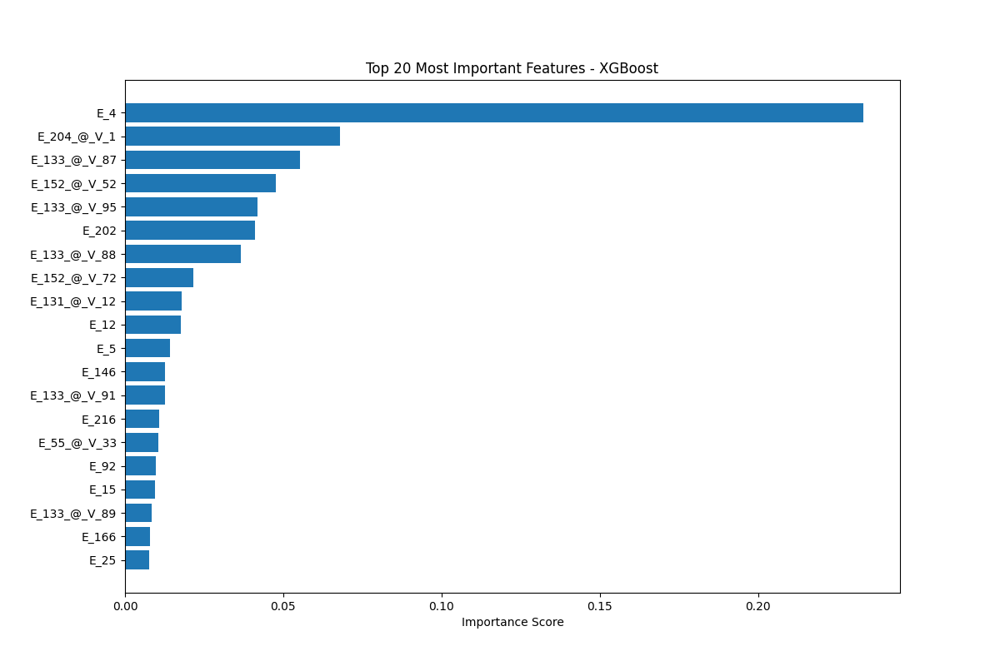
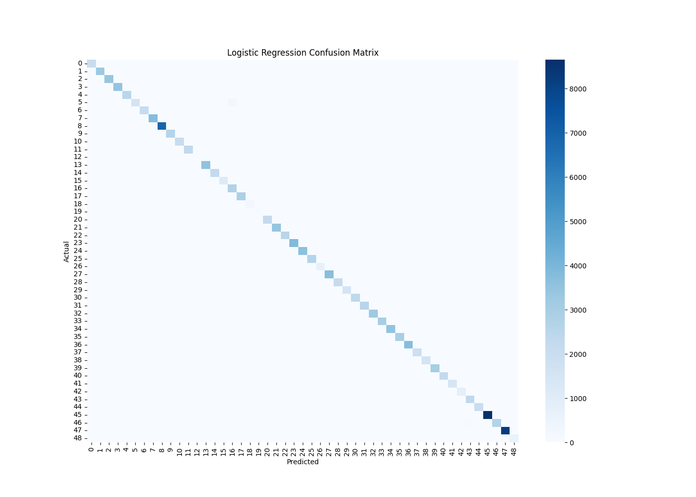
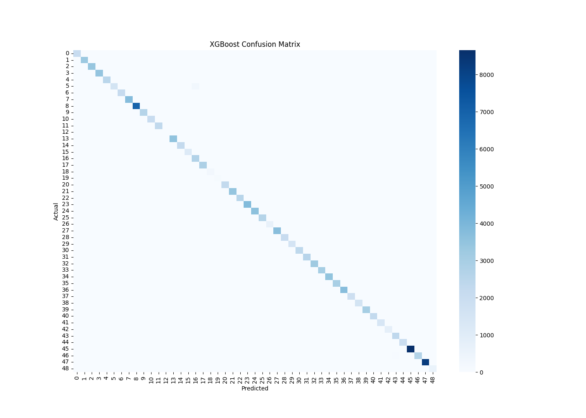

# DDXPlus Automatic Medical Diagnosis using Machine Learning

This project was developed for the Intro to Machine Learning course and focuses on automatic medical diagnosis using the DDXPlus synthetic medical dataset. The objective of the project is to predict patient diseases based on demographic information and symptom evidence using multiple machine learning classification models.

---

# Project Overview

The DDXPlus dataset contains over 1 million synthetic patient records with:

- Demographic information
- Symptom evidence
- Initial evidence
- Differential diagnoses
- Ground truth pathology labels

In this project, symptom evidence was transformed into sparse machine learning feature vectors and used to train multiclass classification models.

The following machine learning models were implemented and evaluated:

- Logistic Regression
- Random Forest
- XGBoost

---

# Repository Structure

```text
.
├── notebooks/
│   ├── 01_Logistic_Regression.ipynb
│   ├── 02_Random_Forest.ipynb
│   └── 03_XGBoost.ipynb
│
├── README.md
├── requirements.txt
└── .gitignore
```

---

# Dataset

Dataset used:
DDXPlus Synthetic Medical Diagnosis Dataset

The dataset contains:

- Training Set: ~1,025,000 records
- Validation Set: ~132,000 records
- Test Set: ~135,000 records

Due to size limitations, the dataset is not included in this repository.

Place the following files inside your working directory before running the notebooks:

```text
train.csv
validate.csv
test.csv
```

---

# Data Preprocessing

The preprocessing pipeline includes:

- Handling symptom evidence strings
- Sparse multi-label encoding using `MultiLabelBinarizer`
- Gender encoding
- Sparse feature matrix generation
- Label encoding for disease classes

Sparse matrices were used to efficiently process the large-scale dataset while reducing memory usage.

---

# Models Used

## Logistic Regression

A sparse multiclass Logistic Regression model trained using the `saga` solver.

## Random Forest

An ensemble tree-based classifier used for multiclass disease prediction.

## XGBoost

A gradient boosting model optimized using histogram-based tree construction for efficient large-scale training.

---

# Evaluation Metrics

The models were evaluated using:

- Accuracy
- Precision
- Recall
- F1-Score
- Matthews Correlation Coefficient (MCC)
- Confusion Matrix

---

# Results

| Model | Accuracy | F1 Score | MCC |
|---|---|---|---|
| Logistic Regression | 0.9972 | 0.9972 | 0.9971 |
| XGBoost | 0.9971 | 0.9971 | 0.9970 |
| Random Forest | Pending | Pending | Pending |

The extremely high classification performance is largely influenced by the synthetic and highly structured nature of the DDXPlus dataset.

---

# Example Visualizations

## XGBoost Feature Importance

The graph below shows the most influential symptom evidence features used by the XGBoost model during disease prediction.



---

## Logistic Regression Confusion Matrix

The confusion matrix demonstrates the strong multiclass classification performance achieved by the Logistic Regression model.



---

## XGBoost Confusion Matrix

The confusion matrix for XGBoost highlights the model's ability to accurately classify disease categories.



---

# Installation

Install the required libraries:

```bash
pip install -r requirements.txt
```

---

# Running the Project

Run the notebooks in the following order:

1. Logistic Regression
2. Random Forest
3. XGBoost

Each notebook includes:

- Data loading
- Preprocessing
- Model training
- Evaluation
- Visualization

---

# Technologies Used

- Python
- Pandas
- NumPy
- Scikit-learn
- XGBoost
- SciPy
- Matplotlib
- Seaborn
- Joblib

---

# Contributors

- Timur Öncü
- Team Members

---

# License

This project was developed for educational purposes.
